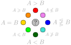

# Legend for website's graphical elements

## Hasse diagrams

The Hasse diagrams show parameter inclusions.
Arrows that can be implied by other arrows are hidden for clarity.
Parameters are represented by boxes with relations between them are depicted by directed edges.

**Parameter box** identifies a parameter by its most prominent name.
Alternative names are listed on its page.

**Directed edges** depict inclusions.
An edge from A to B implies that if A is upper bounded by $k$ then B is upper bounded by $f(k)$ where $f$ is a computable function.
Style of an arc represents the known upper bound on $f$:

* very thick black - $f$ is a constant, i.e., $A$ can have unbounded values while $B$ is always constant $O(1)$
* thick black - $f$ is a linear or sublinear function $O(k)$
* thin black - $f$ is a polynomial function $k^{O(1)}$
* dotted - $f$ is an exponential $2^{O(k)}$ or tower function
* gray - the value of $f$ inclusion is not yet filled in HOPS

Graphs are depicted in Hasse diagrams as well, for that purpose $k$ is assumed to be arbitrary.

## Local Hasse diagrams

Are the same as the Hasse diagrams above but display a subset of parameters.

## Diagram for a fixed parameter or a fixed graph

For the sake of brevity we simplify the notation $A(G) \le f(B(G))$ for $G \in \mathcal G$ to simply $A \le B$, read [Parameter relations](../) to understand that notation.
With such notation, we remark that $A < B$ is not the same as $B \not\le A$ because $\le$ stands for upper bounds and not direct inequalities.
Hence, $A < B$ says that we know $B$ upper bounds $A$ and $B$ does not upper bound $A$; while $B \not\le A$ only says that we know that $A$ does not upper bound $B$.

Color-coded diagrams show inclusions for a particular parameter or graph class based on the following legend.

    

Given two sets $A$ and $B$ we can express their (one way) relation by $A \le B$, $A \not\le B$, or unknown; similarly for the other direction either $B \le A$, $B \not\le A$, or unknown.
When the information about both directions is known we get a full picture about their relation as follows.

* ■$A \le B$ and ■$A \ge B$ implies ■$A = B$
* ■$A \not\le B$ and ■$A \ge B$ implies ■$A > B$
* ■$A \le B$ and ■$A \not\ge B$ implies ■$A < B$
* ■$A \not\le B$ and ■$A \not\ge B$ implies that ■$A$ is incomparable to $B$

The secondary colors cyan■, lime■, magenta■, and orange■ represent partial results while primary colors red■, green■, blue■, and yellow■ represent complete results.

The colors were chosen to represent propagation of tractability and hardness results.
When a problem $P$ is tractable for bounded $A$, then $P$ is also tractable on lime■ and green■ parameters.
Similarly, when $P$ is hard for bounded $A$, then $P$ is also hard on all red■ and orange■ parameters.
The blue■, magenta■, and cyan■ represent that tractability or hardness for that parameter needs to be derived independently of $A$.

## Pairwise relation tables

A 2D table allows a simple depiction of all pairwise relations at once.
Each cell at row $A$ and column $B$ represents relation from parameter $A$ to $B$.
Assuming $A$ is fixed, the color coding is identical to the above legend for diagrams.
Hence, a diagram visible within a specific parameter $A$ is shown as a single row in the table.

## Relevance

Relevance is meant to give a very rough direction for people who are not familiar with some of the parameters.
This value is entered manually which inadvertently introduces personal bias.
The hope is that eventually each parameter is somewhat correctly categorized as viewed by the community.
If you feel some values are significantly incorrect, then let us know.
